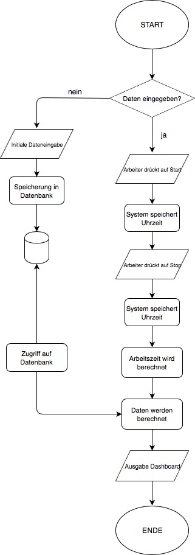

Projektidee

# Projektidee

### Ausgangslage
Arbeitnehmer, die auf Stundenbasis arbeiten, haben oft wenig bis keine Übersicht über Ihre geleisteten Stunden. Meist bekommen sie erst am Ende des Monats eine Abrechnung der Stunden, wodurch sich der Lohn ergibt. Sie haben keine detailgetreue Einsicht, die sie täglich verfolgen können, um zu schauen, ob sie gerade über dem eigentlichen Pensum arbeiten oder sogar unterhalb.

### Funktion Projektidee
Mittels einer Software soll es Arbeitern möglich sein, eine Übersicht über Ihr Arbeitspensum auf Tagesbasis zu erhalten. Im Programm sollen Start sowie Ende der Arbeitszeit jedes Arbeitstages eingegeben werden. Durch eine einmalige Eingabe von Daten (Stundenlohn, Ziel der Stunden pro Monat) sollen diese Stunden folgende Punkte ausrechnen:
- Arbeitspensum des Tages in %
- Arbeitspensum des bisherigen Monats in %
- Anzahl Überstunden des Tages
- Anzahl Überstunden des bisherigen Monats
- Bisher verdientes Geld

Diese Punkte sollen wenn möglich grafisch in einem Dahsboard erscheinen.

### Workflow
